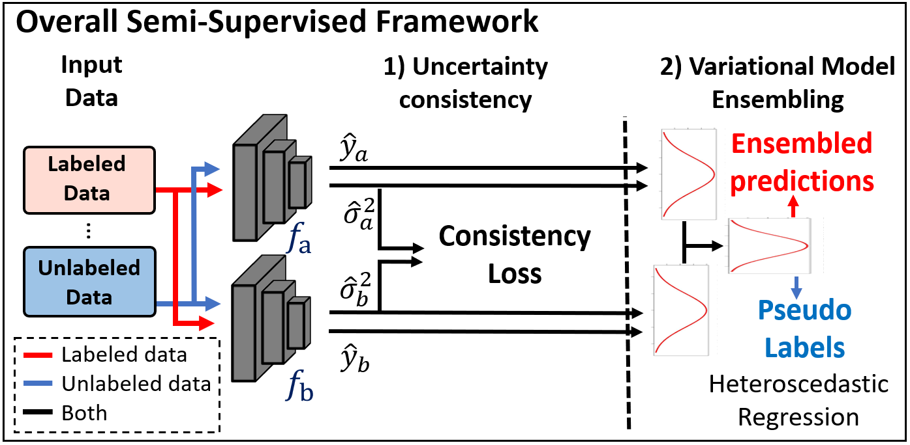

# Semi-Supervised Deep Regression with Uncertainty Consistency and Variational Model Ensembling via Bayesian Neural Networks


This is the implementation of UCVME for the paper ["Semi-Supervised Deep Regression with Uncertainty Consistency and Variational Model Ensembling via Bayesian Neural Networks"]().



<br />
<br />

## Data

Researchers can get the UTKFace dataset from https://susanqq.github.io/UTKFace/ (Aligned&Cropped Faces). Extract the zip file and set up the files according to the example files in DATA_DIR/UTKFace

```
DATA_DIR
 |_ FileList.csv
 |_ UTKFace
    |_ 1_0_0_20161219140623097.jpg.chip.jpg
    |_ 1_0_0_20161219140627985.jpg.chip.jpg
    |_ 1_0_0_20161219140642920.jpg.chip.jpg
    ...
```


<br />
<br />

## Environment

It is recommended to use PyTorch `conda` environments for running the program. A requirements file has been included. 

<br />
<br />

## Training and testing


### To perform training, run:

```
python3 ucvme_age.py --output=<OUTPUT_DIR> 
```


### To perform testing only, run:

```
python3 ucvme_age.py --output=<OUTPUT_DIR> --test_only
```


<br />
<br />


## Pretrained models

Trained checkpoints and models for the 10% labeled dataset setting can be downloaded from:
https://hkustconnect-my.sharepoint.com/:f:/g/personal/wdaiaj_connect_ust_hk/Epq-44XUV_lIoUe7IdkZo44B6vBgiqGIxo6tgCxMQsU48A?e=Uf3GQu 


To run with the pretrained model weights, replace the `.pts` files in the target output directory with the downloaded files. 

<br />

|  Experiments         | MAE   | R<sup>2</sup>   |
| ---------- | :-----------:  | :-----------: |
| 10% labeled dataset    | 5.26  &plusmn; 0.02  | 57.9%	&plusmn;  0.3 |

<br />
<br />

## Notes
* Contact: DAI Weihang (wdai03@gmail.com)
<br />
<br />

## Citation
If this code is useful for your research, please consider citing:


```
@article{dai2023semi,
  title={Semi-Supervised Deep Regression with Uncertainty Consistency and Variational Model Ensembling via Bayesian Neural Networks},
  author={Dai, Weihang and Li, Xiaomeng and Cheng, Kwang-Ting},
  journal={Proceedings of the AAAI Conference on Artificial Intelligence},
  volume={37},
  number={6},
  pages={7304--7313},
  year={2023}
}

```